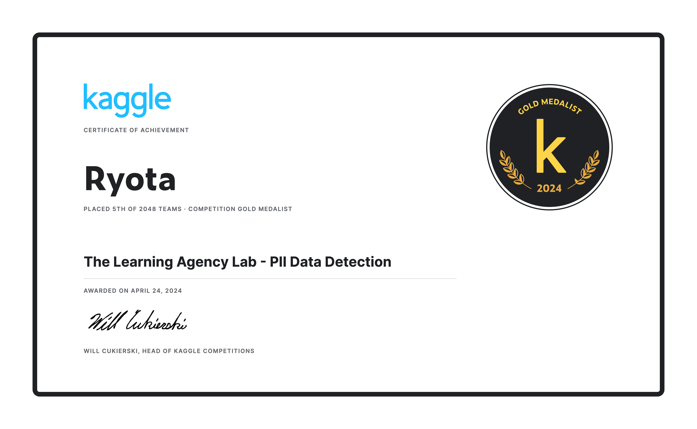

## The Learning Agency Lab - PII Data Detection - 5th Place Solution [to be updated]

This repository contains the code for the 5th place solution (Ryota Part) in the [PII Data Detection](https://www.kaggle.com/competitions/pii-detection-removal-from-educational-data/overview) competition hosted on Kaggle.
In this competition, participants were tasked with developing machine learning models to detect personally identifiable information (PII) in student writing. The objective is to create automated methods for identifying and removing PII from educational datasets, thereby facilitating the release of these datasets for research and development of educational tools while ensuring student privacy.

For detailed our solution, please refer to the [discussion](https://www.kaggle.com/competitions/pii-detection-removal-from-educational-data/discussion/497306) on Kaggle.

## Reproducing 5th place solution [to be updated]
### 1. Data Download
Use the following command to download the competition data and external datasets:
```
sh download.sh
```
### 2. Preprocess

### 3. Train Models
